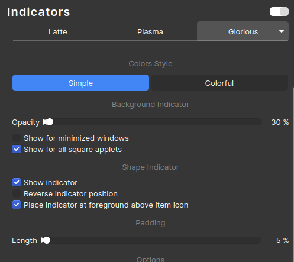

# Latte Glorious Indicator

A glorious indicator theme for [Latte Dock](https://github.com/KDE/latte-dock).

<p align="center">
	
	<br/>
	<i>
		Simple color style with default indicator settings
	</i>
</p>

<p align="center">
	
	<br/>
	<i>
		Colorful color style with modified indicator settings
	</i>
</p>

<p align="center">
	
	<br/>
	<i>
		Indicator settings
	</i>
</p>


## Requirements

- Latte dock git master branch
- Latest or updated Qt and Plasma frameworks and libraries.

## Installation

1. Just `cd` to the cloned repo.
2. Execute ```$ kpackagetool5 -i . -t Latte/Indicator```.
3. Set the indicator theme to `Glorious`.

## Credits

This indicator theme is heavily inspired by [latte-indicatory-unity](https://github.com/psifidotos/latte-indicator-unity) theme by [psifidotos](https://github.com/psifidotos).
